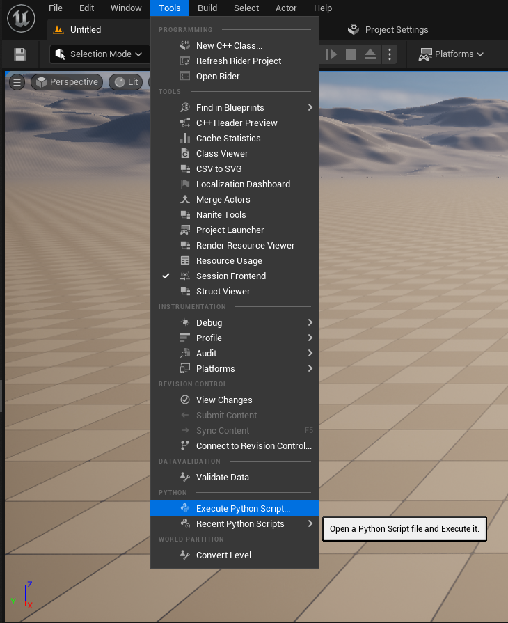

# PythonScriptingDemo
A sample project demonstrating how to run python scripts in Unreal Engine to create or modify assets.

If you would like to learn more, I suggest you look through Unreal Engine's Python package documentation [link](https://docs.unrealengine.com/4.27/en-US/PythonAPI/class/EditorAssetLibrary.html)

To run the script, click on `Tools > Execute Python Script..` and select the script found in `Source/Scripts/create_assets.py`. 

  

